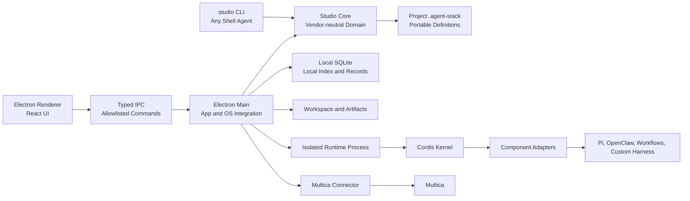

# 技术架构

## 1. 架构目标

第一版只支持 macOS，采用本地优先的 Electron 桌面架构。界面使用 Web 技术实现，但封装在桌面应用中，不要求用户打开浏览器，也不暴露 localhost 服务。

## 2. 推荐技术栈

| 层 | 选择 | 原因 |
| --- | --- | --- |
| 桌面容器 | Electron | 与 Node.js、Cordis、本地 CLI 和文件系统集成直接 |
| UI | React + TypeScript + Vite | 适合列表、详情、表单和状态密集型桌面界面 |
| 数据校验 | Zod | 统一验证 IPC、清单和配置数据 |
| 本地数据库 | SQLite | 无需服务，易备份，适合单用户本地数据 |
| 数据访问 | 轻量迁移层或 Drizzle | 保持 schema 可迁移和类型安全 |
| 运行内核 | Cordis，锁定版本 | 负责 Service、依赖注入、生命周期和运行时组合 |
| 测试 | Vitest + Playwright | 覆盖领域逻辑、IPC 和主要桌面工作流 |
| 打包 | electron-builder 或 Electron Forge | 生成签名和公证所需的 macOS 安装包 |

具体依赖版本由开发任务在创建工程时锁定，并记录在 lockfile 中。

## 3. 进程边界

### Renderer

- 只负责界面和用户交互。
- `nodeIntegration` 关闭，`contextIsolation` 开启。
- 不能直接访问文件系统、数据库、Shell 或密钥。
- 通过预加载层暴露的白名单 API 调用 Main。

### Electron Main

- 管理窗口、菜单、系统对话框和应用生命周期。
- 执行数据库事务、工作区读写和连接器调用。
- 验证所有 IPC 输入，维护操作审计记录。
- 启动和终止隔离的 Runtime 子进程。

### Runtime Process

- Cordis 运行在独立 Node.js 子进程中，不进入 Renderer。
- 科研 Run 默认使用全新进程，避免热替换残留状态污染结果。
- 每次运行接收不可变的 Run Manifest，只把事件和产物写回 Main。
- 超时、取消和进程崩溃必须被记录为明确状态。

## 4. Cordis 的职责边界

Cordis 从第一阶段进入内核，但不成为产品数据模型。

Cordis 负责：

- Service 注册和依赖解析。
- 插件注入和生命周期管理。
- Fiber 或 Effect 范围内的启停与清理。
- 运行时配置分发。

Studio 负责：

- Agent、Component、Stack、Experiment、Run 等领域模型。
- 能力覆盖、Owner 选择、冲突和兼容性状态。
- 版本、审计、复现和用户交互。
- 把已验证的 Stack 编译为 Cordis Runtime Plan。

这不是重新实现 Cordis。领域模型回答“用户组合了什么以及为什么”，Cordis 回答“这些服务在进程中如何实例化、依赖和销毁”。Studio 不再实现第二套通用依赖注入容器或插件生命周期系统。

第三方组件不直接暴露 Cordis 类型。Adapter 把稳定的 Studio Component Contract 转换为内部 Cordis Service。这层边界用于控制 Cordis API 变化和第三方耦合，不负责重复实现 Cordis 的运行能力。

## 5. Cordis 风险控制

- 锁定经过验证的 commit 或维护内部镜像，不跟随未评估升级。
- 为 Service 生命周期、错误恢复和 disposer 编写契约测试。
- 不把 Cordis 的热替换等同于外部副作用回滚。
- 未知组件在独立进程运行，后续再增加更强沙箱。
- 服务键使用命名空间和版本，避免不同组件发生隐式覆盖。
- 每次 Run 冷启动，记录 Cordis 版本和 Runtime Plan 哈希。

## 6. 数据与文件

建议的数据位置遵守 macOS Application Support 约定：

- SQLite：Agent、版本、组件元数据、实验定义、运行索引。
- Workspace：用户可查看的清单、生成的 Adapter、Workflow 和导出包。
- Artifacts：日志、轨迹、指标和运行产物。
- Secrets：优先存入 macOS Keychain，数据库只保存引用标识。

用户应能导出一个不包含密钥的可移植 Agent Stack Package。

## 7. 插件与组件加载

每个 Component Package 至少包含：

- Manifest：身份、版本、来源、许可、入口和支持平台。
- Capability Descriptor：提供和占用的能力。
- Configuration Schema：用户可配置项和敏感字段声明。
- Runtime Adapter：转换为 Cordis Service 或外部 Harness 调用。
- Health Check：静态预检和可选运行验证。

导入扫描分为静态扫描与可信执行。默认只做静态扫描；需要执行项目脚本时必须明确提示用户。

## 8. Workflow 执行

Workflow 是版本化 DAG。节点可以是普通操作、组件调用、Agent Version 或子 Workflow Version。

- 保存时检查循环引用。
- 执行前把 DAG 编译成 Runtime Plan。
- Hybrid 模式必须标出 Agent Loop 与 Workflow 的控制权切换点。
- Workflow 变化属于实验变量，除非它被明确锁定。

## 9. 安全基线

- Electron 启用上下文隔离，禁用 Renderer Node 权限和不安全远程内容。
- IPC 使用白名单命令和 schema 校验，不提供任意 Shell 接口。
- Shell 调用使用参数数组，不拼接命令字符串。
- 密钥不进入日志、Run Manifest、导出包或 Renderer 状态。
- 本地目录访问经由用户选择或受控工作区授权。
- 发布 Multica 前展示数据范围，并要求用户主动确认。

## 10. 可测试性

- Domain 层测试能力覆盖、Owner 决策、冲突和实验锁定。
- Runtime 契约测试 Cordis 生命周期、取消、超时和清理。
- Connector 使用录制样例或测试环境验证，不在单元测试访问真实账号。
- Playwright 覆盖创建 Agent、解决冲突、建立实验和发布预检。
- 每个 PR 或自动推送分支必须通过类型检查、单元测试和构建检查。

## 11. M6 数据升级与恢复边界

- 备份和恢复由 Main 侧 `DataMaintenanceService` 执行，Renderer 只能通过经 Zod 校验的白名单 IPC 发起原生目录选择、预检和明确恢复。
- SQLite 备份使用在线 backup API 生成一致性快照，不直接复制可能仍有 WAL 写入的数据库文件。
- 备份清单固化格式版本、应用版本、数据库 schema 与每个数据文件的 SHA-256。日志、Keychain 密钥原文与符号链接被结构化排除。
- 恢复先复制到 Application Support 内的待恢复区。应用重启后，在任何 Repository 打开前生成自动回滚备份，然后替换 SQLite、Workspace 和 Artifacts；文件级失败会回滚。
- 恢复的旧 schema 通过既有事务式迁移链升级。如果数据库 schema 高于当前应用支持版本，启动直接阻断，不执行隐式降级。

## 12. M7 Studio Core 与双入口

- `src/core` 不依赖 Electron Renderer，并由 Electron Main 与 `studio` CLI 共用。验证、Owner、删除保护和版本冻结不能在适配层复制。
- `.agent-stack` 是可移植定义的唯一可编辑事实来源；SQLite v7 的 `studio_projects` 只保存路径和观察元数据。
- Renderer 仍只通过 Zod 校验的 Preload 白名单访问项目操作。文件选择、监视和 CLI 路径发现由 Main 管理。
- Core 使用 revision 乐观并发、同目录原子替换和最后有效备份。外部文件变化触发 GUI 重新读取。
- CLI 构建与应用共享 `package.json` 版本，应用只展示可执行路径，不写 PATH 或 Shell profile。

## 13. M8 来源发现边界

```mermaid
flowchart LR
    USER["用户或 Coding Agent"] --> ENTRY["GUI / studio source"]
    ENTRY --> CONTRACT["SourceDiscoveryProvider"]
    CONTRACT --> GH["GitHub Public REST Adapter"]
    GH --> META["Provider-reported Metadata"]
    META --> HANDOFF["Review-required Handoff"]
    HANDOFF -. "Studio 不执行" .-> SHELL["人工 Shell / Coding Agent"]
    SHELL --> LOCAL["本地仓库"]
    LOCAL --> SCAN["M7 Static Inspector"]
```

- `src/core/source-discovery.ts` 只定义 Provider 接口和下载交接格式；GitHub 网络字段由 `src/adapters/github` 映射为共享来源类型。
- Electron Main 与 CLI 各自实例化同一个 GitHub Adapter。Renderer 只能通过 Zod 校验的搜索、检查、交接、取消、复制和 GitHub URL 白名单 IPC 操作访问它。
- Adapter 只访问固定 GitHub 公共 API，使用固定版本头、超时、ETag 和 rate-limit 响应头。请求不自动重试，不并发轮询。
- 查询与结果不持久化。下载交接是数据，不是执行许可；只有本地目录经过 M7 静态导入后才能成为项目 Component。

## 14. M9 默认拒绝与发布完整性

- `src/main/security` 集中管理 Electron Session 与 WebContents 的默认拒绝策略。全局沙箱在 `ready` 前启用，窗口安全参数全部显式声明。
- Session 拒绝 permission check、permission request、设备访问和下载；WebContents 拒绝新窗口、导航和 WebView。未来例外必须按最小权限单独设计。
- IPC Handler 在 schema 校验前验证 Sender Frame 仅来自本地 `file:` Renderer；Preload 暴露能力仍由现有频道白名单限制。
- Renderer CSP 不允许网络连接、远程脚本、对象、表单、Frame、媒体或 Worker。GitHub 请求继续只发生在 Main/CLI Adapter。
- macOS 包验证直接读取 `app.asar` 中的 Renderer HTML 与 Main 构建，随后按发布清单重算 DMG/ZIP SHA-256。该校验补充但不替代 Developer ID 和 Apple 公证。

## 15. M10 项目历史完整性

- `src/core/project-integrity.ts` 是 GUI、CLI 和 ProjectStore 共用的唯一历史审计实现。
- ProjectStore 在结构/schema 迁移后、返回项目状态前重算每个 Version snapshot 的 SHA-256，并检查版本序列、项目归属、来源 revision、组件集合与 Owner 引用。
- `project audit` 使用 `recover: false` 的只读读取；普通 inspect/GUI 可以按既有边界恢复最后有效 `.agent-stack.backup`，但必须保留无效原件并显示恢复状态。
- `ProjectIntegrityReport` 经共享 Zod schema 进入 Preload/Renderer；Renderer 只负责表达结果。
- 哈希覆盖 Version snapshot；Version ID、创建时间等外层元数据受结构和语义约束，但 M10 不提供密码学身份认证。

## 16. M11 Keychain 与最终应用 E2E

- `src/adapters/keychain` 使用固定系统二进制 `/usr/bin/security` 和参数数组；提示响应经 stdin 发送，密钥不出现在 argv。
- `SecretService` 协调系统钥匙串与 SQLite 引用。Renderer 只提交用途与账户；Main 通过固定 AppleScript 调起 macOS 原生隐藏输入，再直接写入 Keychain。状态对象不含原文，`readForRuntime` 只留在 Main 受信边界。
- `studio secret set` 必须声明 `--stdin`，机器 envelope 只返回 service、account 和状态。CLI 与 GUI 使用相同服务/账户时观察同一个本机条目。
- 正式 `.icns` 由 electron-builder 写入应用包；发布验证读取 Info.plist 并检查实际 Resources。
- `test:e2e:packaged` 只在测试启动参数中开放本机 DevTools 端口，直接检查打包 Renderer、中文设置页和截图。正常应用启动不监听端口。
- GitHub `macos-15-intel` runner 负责 Intel 构建契约，本地 Apple Silicon 负责 arm64。两个架构分别生成产物和哈希；当前不生成 Universal Binary。

## 17. M12 本地可信执行 Profile

- `src/shared/trusted-execution.ts` 保存内置 Workflow Version、入口节点、用户可见模式说明和精确 Runtime Adapter 白名单。白名单只接受完整引用，不接受命名空间前缀匹配。
- Main 在创建 Run Manifest 前解析执行模式并验证所有激活 Service 的 Adapter。未注册 Adapter 在创建 Run 记录前失败，不能先排队再由 Runtime 异步报错。
- Workflow 使用内置线性 Profile；Hybrid 固化 `workflow-to-agent` handoff；External Harness 只允许内置 Harness X Controller。绑定标识进入 Manifest 内容哈希。
- Runtime 根据 Manifest 中的判别联合执行四种内置路径，仍只处理结构化数据，不 `import`、`spawn` 或调用导入组件代码。
- Agent Loop、Hybrid 与 External Harness 的 Runtime Plan 必须提供 `execution-controller`。能力页面直接展示编译器返回的同一 Stack 状态。

## 18. M13 Agent 生命周期边界

- Agent 长期身份、归档状态及其 Run/Experiment/Receipt 等本机关系继续位于 SQLite；不得为了增加生命周期操作把 Agent 身份复制进只承载 Component、Stack、Owner 和 Version 的 `.agent-stack`。
- `AgentService` 是 Main/API 的生命周期边界。复制在事务内复用当前 Stack component/owner 选择，但创建全新 ID、revision 1 和工作空间，不复制任何历史或密钥引用。
- 永久删除前由 Repository 在同一数据库连接上检查所有历史引用；SQLite 外键继续作为第二道完整性保护。文件工作空间只在数据库删除成功后清理。
- 归档状态进入共享 Zod 与 IPC 白名单。Run、Experiment、Publish 和 Version 创建统一调用 active-Agent guard，Renderer 不复制这一判断。
- v8 迁移只增加可空 `archived_at` 与索引，保证既有 Agent 默认为 active；失败迁移事务回滚后可以在修复冲突后重试。

## 19. M14 项目启动与外部刷新契约

- Electron Main 在创建 Renderer 前解析唯一的 `--project <path>`，并调用 `StudioProjectService.open`。路径不经 Renderer 或 IPC 传递。
- 启动项目、原生选择器打开的项目和 CLI `--project` 都进入同一 Studio Core/ProjectStore，不引入第二份领域或验证逻辑。
- ProjectStore 继续通过同目录临时文件和 rename 原子替换 `.agent-stack`。Main 监听父目录并精确过滤目标文件名，避免 watcher 绑定到被替换的旧 inode。
- 每次外部修改重新读取共享 schema、完整性和 revision；哈希未变时不发送冗余 Renderer 通知。
- packaged E2E 不用 mock Core 或 mock CLI，直接调用 `.app` 内可执行 CLI 并通过 Chromium CDP 操作最终 Renderer。

## 20. M15 纯分发层契约

- `config/release-compatibility.json` 是分发兼容清单，不是项目文件、数据库表或 Runtime Manifest。它只记录已有契约的版本和职责边界。
- 应用版本不在 compatibility manifest 中复制，而是显式指向 `package.json#version`。自动化测试将项目常量、JSON Schema、SQLite schema、Bundle ID 和最低 macOS 与清单对齐。
- `config/release.default.json` 通过 `schemas/release-config-v1.schema.json` 与 Zod 双重表达。环境只能覆盖渠道、URL 和三个 Apple 要求布尔值；凭证仍只由 electron-builder/Apple 工具读取。
- 非 local 渠道没有 HTTPS 下载基址时 dry-run 阻断。公证要求依赖签名，staple 要求依赖公证，无效组合在打包前拒绝。
- compatibility、默认 release config 和其 JSON Schema 作为分发元数据进入 ASAR；包验证逐字节与源文件对比。

## 21. M16 数据位置契约

- `DataMaintenanceService` 持有从 `app.getPath('userData')` 派生的全部内部路径，状态投影显式标记用途、文件/目录类型和是否进入备份。
- Renderer 不拼接、不选择、不读写这些路径。`maintenance:reveal-data-location` 只接受严格位置 ID 枚举，Main 再映射为 Finder 动作。
- 不新增自动卸载或删除 IPC。Application Support、外部 `.agent-stack` 和 Keychain 条目的移除是用户明确的分步手动操作。

## 22. M17 应用偏好契约

- `ApplicationPreferencesService` 在 Main 内使用已有 v7 `app_preferences` 表，以 `contractVersion: 1` 的 Zod 契约读写窗口、侧栏和最后视图；未知/损坏值整体回退默认。
- BrowserWindow 保存 `getNormalBounds()` 而非最大化后的物理边界，并单独保存 maximized。启动时与当前 display work area 求交，至少 100×100 可见才恢复 x/y。
- Renderer 只能提交 `sidebarCollapsed` 和 `lastView` 完整对象，不能修改窗口坐标、数据库 key 或任意 JSON。

## 23. M18 Agent Stack Package 契约

- `src/core/agent-stack-package.ts` 是 GUI 与 CLI 共用的唯一构建、便携性审计、哈希验证和原子写入实现。
- `schemas/agent-stack-package-v2.schema.json` 封装完整 `.agent-stack` v2 项目事实、`package.json#version` 应用版本、显式排除清单和 SHA-256；v1 Schema 作为历史读取边界保留，当前包格式版本进入 release compatibility manifest。
- 导出使用 `recover: false` 读取，因此不会把未审计的损坏项目或失败恢复结果包装成可分享事实。
- 完整项目快照在导出时原样保留，确保 Version `contentHash` 继续可验证。便携性审计发现本机路径或敏感 URL 时拒绝导出，不重算或改写旧 Version。
- Main IPC 只接受空输入，导出路径由原生 Save Dialog 决定；Preload 和 Renderer 只获得经 Zod 校验的导出回执。

## 24. M19 Agent 状态投影契约

- `AgentStatusService` 是 Main 内的只读应用服务，按 Agent ID 组合 `AgentService`、`ComponentService`、`RunService`、`ExperimentService` 与 `PublishService` 已有事实。
- 投影不进入 SQLite、`.agent-stack`、Version 快照、Runtime Manifest 或发布包；它没有迁移，也不能成为新的事实来源。
- 列表与详情分别通过 `agent-status:list` 和 `agent-status:get` 暴露同一严格共享 Schema。输入只允许归档范围或 Agent UUID，不接受路径、数据库位置、查询表达式或密钥字段。
- 最近 Run/Experiment 使用各自按创建时间倒序的 Repository 结果；最近发布跨允许目标比较 Receipt 完成时间或创建时间。没有 Receipt 时明确为未发布，未配置的真实 Multica Target 不构成发布事实。
- Renderer 在进入概览和返回列表时重新读取投影，保证长时间 Run 后不会继续显示旧快照；既有领域写操作及 `agents.list` 契约保持不变。

## 25. M20 组件目录与详情投影契约

- `ComponentCatalogService` 只组合 `ComponentService.list/getStack` 与 `AgentService.list/get`。当前使用方来自 Stack 草稿；受影响版本来自不可变 `AgentVersion.snapshot.stack.components`。
- 投影不写回 Component Descriptor、Agent、Version、SQLite 或项目文件，不引入新的“使用关系”或“验证事件”表。
- `validationRecord.recordedAt` 只在验证状态不是 `declared` 时使用 Component 记录的 `updatedAt`，含义是“当前验证结论的记录时间”，不是重新执行测试的时间。declared 返回 `null`。
- `components:catalog` 不接受输入；`components:get` 只接受严格 UUID。Main 输出统一经 `ComponentCatalogItem` Zod Schema 复核，Renderer 不能传数据库、路径或执行参数。
- Descriptor 的 source、runtimeAdapter 与 configSchema 仅作为只读引用展示。目录/详情不会读取引用目标、加载 Adapter、解析任意 Schema 文件或执行来源代码。

## 26. M21 Workflow 与项目格式 v2 契约

- `project-model.ts` 是 Workflow 草稿、节点、边、不可变 Version 与项目格式 v2 的唯一领域 Schema；SQLite 不复制这些可移植事实。
- 草稿内 DAG 校验使用可达性检查，在原子写入前拒绝自环和回边。项目 Schema 另以 Version ID 图遍历跨 Workflow 引用，拒绝直接或间接循环及不匹配的 Workflow/Version 对。
- Workflow Version 和项目 Version 分别维护 SHA-256；项目完整性审计同时复算 Workflow Version，Component 删除检查草稿与历史 Workflow 引用。
- ProjectStore 支持 v0→v1→v2 语义迁移、失败备份恢复和 v3+ 前向拒绝。v1 历史项目 Version 快照允许缺少 `workflows`，从而保持原哈希不变。
- `StudioCore`、CLI、Main Service、Zod IPC、Preload 与 Renderer 共享同一写路径和 expected revision。Renderer 仍无 Node、文件系统或数据库访问。
- Agent Stack Package 同步升级到 v2，兼容清单把 `workflows` 列为 portable fact；最终包同时携带 v1/v2 Schema。
- 结构化 Workflow 目前是编排事实与版本输入。它不会绕过 ADR 0008：Runtime 只执行内置可信 Workflow Profile，未知项目节点不被加载或执行。

## 27. M22 派生处置任务与 Component 生命周期

- `src/shared/remediation.ts` 定义严格 Zod Schema 和纯函数。Main Runtime Plan 编译器与 Studio Core 项目验证传入相同的 Component ID、名称和兼容结论，得到确定性的相同任务链。
- `runtimePlanCompilation` 与 `projectValidation` 把 `remediationTasks` 作为即时输出；`.agent-stack` v2、Agent Stack Package v2、SQLite v8 和 Runtime Plan v1 均不增加持久化字段。
- CLI 的 `project validate` 在稳定 JSON data 中返回完整任务，并把待完成项投影为 suggestedActions；Renderer 通过既有严格 IPC 输出读取，不新增路径或执行 IPC。
- `contract-tested` Adapter 仍产生一项 required 的 `runtime-validation`。只有 Descriptor 已为 `runtime-verified` 时任务链为空并允许兼容性检查通过。
- Component 删除继续由 Studio Core 同时检查 Stack、项目 Version、Workflow 草稿和 Workflow Version 引用；GUI 取消只改变本地视图状态，不调用 IPC。

## 28. M23 Run 历史投影契约

- `RunHistoryService` 是 Main 内的只读应用服务，组合 `RunService` 的 Run/事件/Artifact 与 `ExperimentService` 的已保存定义和单元关联。
- Prompt、随机种子、超时、重试、并发和执行控制快照只读取不可变 Run Manifest；耗时由已保存的 `startedAt` 与 `finishedAt` 计算。
- 关联 Experiment 时，服务用 Run Manifest 构造当次控制快照，并与实验定义中的锁定控制变量调用同一 `checkDrift` 纯函数。它不读取当前 Stack，因此后续编辑不会改写历史结论。
- 独立 Run 返回 `experiment: null`。共享 Schema、Preload 和 Renderer 必须将其表达为 Drift 不适用，不能将缺失基准序列化为 clean。
- `runs:get` 与 `runs:cancel` 输出经严格 `RunHistoryDetail` Schema 复核；输入仍只允许 Run UUID。该投影不增加 SQLite 迁移、项目格式、Runtime 协议或 CLI 项目协议字段。

## 29. M24 实验矩阵只读派生契约

- `ExperimentDetail` 仍是矩阵页面唯一输入，包含不可变定义、Drift 结果、已保存 cell 与基础 comparison；M24 不增加新的 IPC 方法或输出字段。
- Renderer 只从 cell 状态计算计划数、终态数、成功/需关注数、终态成功率和成功平均耗时。终态集合固定为 `succeeded | failed | cancelled | blocked`，需关注集合固定为 `failed | cancelled | blocked`。
- 状态筛选和文本搜索只作用于内存中的已保存 cell，不触发写 IPC，不改变运行顺序、取消语义或历史记录。
- 相对基线继续由 Experiment 服务按第一个 Prompt/第一个 seed 的成功耗时生成；Renderer 只呈现 comparison，不重算领域比较规则。
- 该切片不改变 SQLite v8、`.agent-stack` v2、Agent Stack Package v2、Runtime Plan/子进程消息、CLI 项目命令或兼容清单。正式分发只需携带同一 Renderer 与既有契约。

## 30. M25 来源发现失败边界

- GitHub Adapter 保留固定 15 秒超时，并将调用方 Abort、Adapter 超时、网络失败、限流、查询错误和 Provider 错误映射为不同的 `StudioCoreErrorCode`；默认请求仍不重试。
- `DISCOVERY_TIMEOUT` 只在 Adapter 自身的 timeout signal 触发时返回；用户取消优先保持 `OPERATION_CANCELLED`，离线或连接失败保持 `DISCOVERY_NETWORK_FAILED`。
- Preload 的六个 discovery 白名单方法统一使用相同错误净化入口，移除 Electron invoke 前缀后才交给 Renderer；输入与成功输出继续分别经过原有 Zod Schema。
- Renderer 的失败展示是临时 UI 状态，不写 SQLite、`.agent-stack`、日志或查询历史；本地少于两字符的校验在 IPC 前完成。
- packaged E2E 只触发本地校验，不让 CI 成功取决于 GitHub 网络。Provider 的 HTTP/timeout/network 语义由注入 Fetch 的 Adapter tests 验证，不引入产品 mock 开关。

## 31. M26 工作区命令中心只读聚合契约

- `CommandCenterService` 只组合 `StudioProjectService`、`AgentStatusService`、`ComponentCatalogService`、`RunService` 和 `ExperimentService` 的既有事实；纯 Core 函数负责摘要、索引、排序与搜索。
- `command-center:snapshot` 不接受输入；`command-center:search` 只接受最长 100 字符的严格查询对象。Main 输入和输出、Preload 输入和输出均经共享 Zod Schema 复核。
- 搜索目的地是显式 discriminated union，仅允许既有页面、实体 UUID 和固定应用动作；不接受路径、URL、数据库表达式、Runtime 参数或密钥字段。
- Renderer 以 3 秒只读刷新投影，活动 Run 时缩短为 500ms；项目外部修改通知会立即刷新。摘要失败不阻断既有页面和本地编辑流程。
- 命令中心不产生数据库迁移，不改变 `.agent-stack` v2、Agent Stack Package v2、Runtime Plan/子进程协议、CLI 项目命令或 release compatibility manifest。

## 32. M27 本地验收门禁契约

- `config/local-acceptance.json` 是验收分类清单，不是产品配置或发布兼容事实；它只列出一级导航、带用途的输入提示和最终包控制。
- `verify-local-acceptance.mjs` 扫描 tracked 与 prospective untracked production 源码，拒绝未处置工作标记、占位/死操作、未分类 harness 和导航契约断裂。
- packaged E2E 使用 CDP Accessibility domain 读取最终 Renderer 的可访问树，并真实点击全部一级导航；它不注入 IPC 结果或替换 Core/Runtime。
- M27 不增加 IPC、数据库迁移、项目/包 Schema、Runtime 消息或 CLI 行为；正式分发继续携带相同业务产物。

## 33. M28 证据图与最终报告契约

- `config/final-evidence.json` 只存放需求/流程/证据引用和预期产物，不进入 Electron 应用包的运行配置或领域输入。
- `evidence-ledger.mjs` 解析两张 Markdown 矩阵为唯一状态来源，验证连续 ID、状态词表、自动化引用、八状态完整性、截图 producer 和外部阻断白名单。
- 报告生成器只读 Git HEAD、矩阵、manifest 和本地产物；输出到被忽略的 `release/`，不将本机绝对路径写回项目事实。
- 公开 snapshot 门禁对不透明二进制采取默认拒绝，仅允许 `build/icon.icns` 与 `build/icon.png`；本地截图不可被 Git 跟踪。
- M28 不增加 Studio Core、IPC、Preload、Renderer 业务、SQLite、项目/包 Schema、Runtime 协议或 CLI 行为。

## 34. M29 稳定性与敏感诊断契约

- Main 进程使用单实例锁和 `077` umask；项目写入、迁移和恢复共享同一排他锁，锁文件含进程与随机令牌，只能回收已死亡进程且超过宽限期的锁。
- Preload 只合并完全相同的只读 IPC；任何写操作开始和结束时都清空合并表。Renderer 用递增请求序号拒绝晚到响应覆盖新状态。
- 发布预检/提交、恢复 staging、Keychain locator、维护对话框和来源发现各自使用确定性的单航班或串行队列；不同恢复来源不得共享结果。
- 所有外部或子进程边界必须有超时、输出上限、AbortSignal 和受控强制清理；Runtime stdout/stderr 正文不进入主日志。
- `sensitive-data.ts` 是日志、CLI、IPC 与 Runtime 诊断净化的共享实现；凭证 URL、Provider token、Authorization 和敏感字段必须在持久化或跨边界前被拒绝或替换。
- M29 不改变 SQLite v8、`.agent-stack` v2、Agent Stack Package v2、Runtime Plan/消息或 CLI 项目命令，正式分发无需重写业务路径。

## 35. M30 单一便携事实源与 Agent 引用契约

- `.agent-stack` v2 继续是项目便携事实文件；M30 收回了 Component/Stack/Owner/Version/Workflow 在 SQLite 的正常读写路径，不新建同步层。
- SQLite v9 新增 `agent_project_links`，以稳定 Agent ID 引用项目 ID、路径和当前不可变项目 Version；Agent Version 可保存 `project-reference`，但运行/发布前必须从对应项目快照在内存中实体化并再校验。
- 主进程的 `StudioProjectService` 是 GUI 投影与本机引用的编排器；GUI 和 CLI 共用 Studio Core 的项目读写、revision、完整性、Descriptor、Stack、Owner、Workflow 和冻结逻辑。
- `CompatibilityAssessment` 是 Core 的可解释派生结果，根据 platform、entrypoint、capability contract、config/permission/secret 需求、能力冲突、Adapter 契约和证据等级评估；Renderer 不自行推断。
- 运行验证只能通过已受信的精确 Runtime Adapter 白名单进入独立子进程，沿用超时、取消、强制清理、日志脱敏、Artifact 和 Receipt 边界；未知项目的静态检查不执行代码。
- 启动迁移先写经 Core 验证的项目与 `.agent-stack.migration-backup`，再以单一 SQLite 事务写入引用并清理可携副本。任一步失败均可幂等重试；无法无损归属的孤立数据安全停止启动。

M30 明确取代上文 M29 “SQLite v8 不变”的时点性描述；项目/Package 格式仍为 v2，Runtime 消息与 CLI 项目命令保持兼容。
